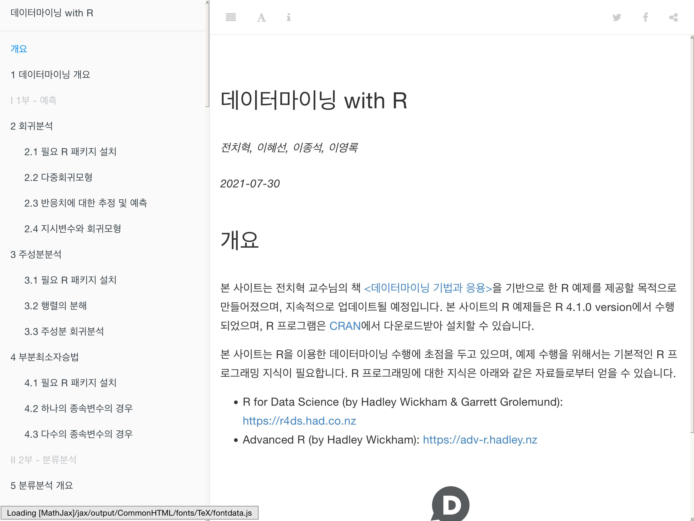
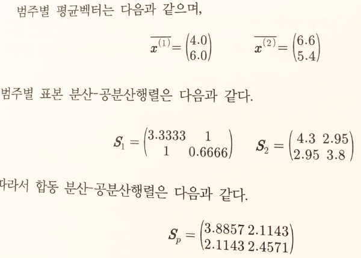
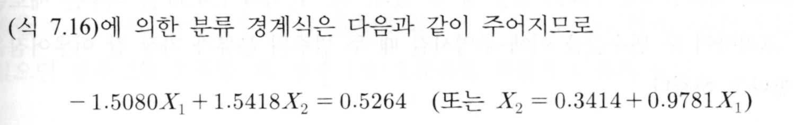
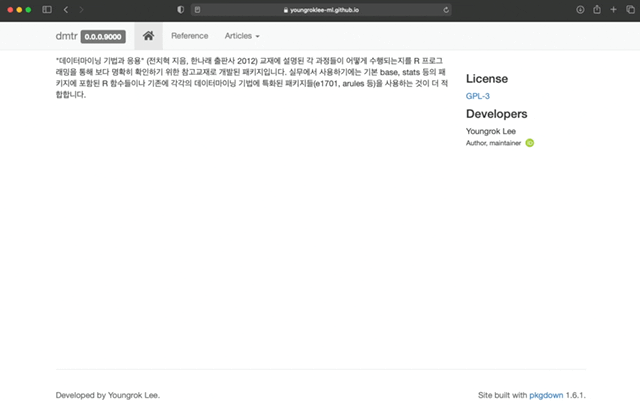

```{r setup, include = FALSE}
library(gt)
library(ggplot2)
library(dplyr)
library(dmtr)

options(
  htmltools.dir.version = FALSE, 
  htmltools.preserve.raw = FALSE,
  tibble.width = 60, tibble.print_min = 6,
  crayon.enabled = TRUE
)

knitr::opts_chunk$set(
  echo = FALSE,
  message = FALSE,
  warning = FALSE,
  comment = "",
  digits = 3,
  tidy = FALSE,
  prompt = FALSE,
  fig.align = 'center',
  # fig.width = 7.252,
  # fig.height = 4,
  dpi = 600
)

# uncomment the following lines if you want to use the NHS-R theme colours by default
# scale_fill_continuous <- partial(scale_fill_nhs, discrete = FALSE)
# scale_fill_discrete <- partial(scale_fill_nhs, discrete = TRUE)
# scale_colour_continuous <- partial(scale_colour_nhs, discrete = FALSE)
# scale_colour_discrete <- partial(scale_colour_nhs, discrete = TRUE)
```


class: title-slide, left, bottom

# `r rmarkdown::metadata$title`
----
### `r rmarkdown::metadata$author`
### `r rmarkdown::metadata$date`

 

---
class: inverse, left, middle

# 발표 개요

----

1. 데이터 분석 문서화에서 패키지 개발로 전환

  - 배경
  
  - 작업 과정
  
2. 데이터 분석가에게 유용한 개발자 관점

  - 프로젝트 관리
  
  - 변화 관리
  
  - 코드의 재사용성 향상


  

---
class: inverse, center, middle

# 데이터 분석 문서화에서 패키지 개발로 전환

## 배경

---

# `{bookdown}`을 이용한 R 예제 책 만들기

.pull-left[

```{r book, echo = FALSE, fig.cap="데이터마이닝 기법과 응용 / 한나래출판사 / 전치혁 저", out.height='400px', fig.align='center'}

```

]

.pull-right[

```{r online-book-webshot, include=FALSE, cache=TRUE}
webshot::webshot(
  url = "https://youngroklee-ml.github.io/data-mining-book/index.html",
  file = "images/onlinebook-main.jpg",
  zoom = 3
)
```

```{r online-book, echo = FALSE, fig.cap="데이터마이닝 with R / 전치혁, 이혜선, 이종석, 이영록 / http://youngroklee-ml.github.io/data-mining-book/", out.height='400px', fig.align='center'}

```

]

---

# 분석 예제: 선형 분류분석

.pull-left[

```{r lda-example, echo=FALSE, out.width='49%', fig.align='center', fig.show='hold'}
data(binaryclass2, package = "dmtr")

binaryclass2 %>% 
  gt::gt()
```

]

.pull-right[

```{r lda-example-plot, echo=FALSE, out.width='90%', fig.align='center'}
binaryclass2 %>% 
  ggplot(aes(x = x1, y = x2, color = class)) +
  geom_abline(slope = 0.9781, intercept = 0.3414, 
              color = "grey20", linetype = "dashed") +
  geom_point(size = 5) +
  geom_text(aes(label = class), vjust = -1, size = 5) +
  scale_x_continuous(
    breaks = seq(1, 10, by = 1),
    minor_breaks = NULL,
    expand = expansion(mult = 0.05)
  ) +
  scale_y_continuous(
    breaks = seq(1, 10, by = 1),
    minor_breaks = NULL,
    expand = expansion(mult = 0.05)
  ) +
  scale_color_manual(
    values = c(`1` = "steelblue", `2` = "firebrick")
  ) +
  theme_light() +
  theme(
    legend.position = "none",
    text = element_text(size = 20),
    aspect.ratio = 1
  )
```

]


---
layout: true

# 교재용 R 패키지 작성의 필요성

- 알고리즘의 단계별 결과를 교재 내용대로 보여주기 위해 함수를 세분화할 필요

.pull-left[

```{r book-covarince, echo = FALSE, fig.cap="교재 예제", out.width='80%', fig.align='center'}

```

]

---

.pull-right[

```{r lda-mass-summary, echo = TRUE, out.width='50%', fig.cap="{MASS} 패키지 결과", fig.align='center'}
library(MASS)
MASS::lda(class ~ x1 + x2, data = binaryclass2)
```

]

---

.pull-right[

```{r lda-dmtr-group-variance, echo = TRUE}
library(dmtr)
group_variance(binaryclass2, class, x1:x2)
```

]

---

.pull-right[

```{r lda-dmtr-pooled-variance, echo = TRUE}
library(dmtr)
pooled_variance(binaryclass2, class, x1:x2)
```

]

---
layout: true

# 교재용 R 패키지 작성의 필요성

- 기존 R 패키지 수행 결과가 교재의 예제와 정확히 일치하지 않는 부분에 대한 혼동을 줄일 필요

```{r lda-book-example, echo = FALSE, fig.cap="교재 예제", out.width='50%', fig.align='center'}

```

---

--

```{r lda-mass-result, echo = TRUE, out.width='50%', fig.cap="{MASS} 패키지 결과", fig.align='center'}
fit <- MASS::lda(class ~ x1 + x2, data = binaryclass2)
coef(fit) %>% drop()
```

--

```{r lda-mass-result-transform, echo = TRUE, out.width='50%', fig.cap="{MASS} 패키지 결과 변환", fig.align='center'}
scaling_adjust <- 2.201359; sign_adjust <- -1;
(coef(fit) * scaling_adjust * sign_adjust) %>% drop()
```


---

```{r lda-dmtr-result, echo = TRUE}
dmtr::fisher_ld(binaryclass2, class, x1:x2)
```


---
layout: false

# 교재용 R 패키지 작성의 필요성

- 분석 알고리즘을 교재와 일치하도록 함수로 구현

```r
fisher_ld <- function(.data, .group_var, .xvar) {
  .group_var <- rlang::enquo(.group_var)
  .xvar <- rlang::enquo(.xvar)

* mu_hat <- group_mean(.data, !!.group_var, !!.xvar)

  if (length(mu_hat) != 2L) {
    stop("number of levels of .group_var must be 2.")
  }

* sigma_hat <- pooled_variance(.data, !!.group_var, !!.xvar)

* res <- solve(sigma_hat) %*% purrr::reduce(mu_hat, `-`) %>% drop()

  attr(res, "group") <- attr(mu_hat, "group")

  return(res)
}
```

```{r, include=FALSE}
detach("package:MASS", character.only = TRUE)
```


---
class: inverse, center, middle
layout: false

# 데이터 분석 문서화에서 패키지 개발로 전환

## 작업 과정


---

# 현실적인 작업범위 및 기대수준 정의

- 참고교재

- 실무용 아님

- 제한된 유연성

---

# 편리한 작업환경 선택

.pull-left[

- RStudio IDE

- `{devtools}`, `{usethis}`, `{testthat}`, etc.

- Git and GitHub

]

--

.pull-right[

```{r r-packages-book, echo = FALSE, fig.cap="R Packages / O'Reilly / Hadley Wickham", out.width='40%', fig.align='center'}
knitr::include_graphics("images/r-pkgs-cover.png")
```

]


---
layout: true

# R 스크립트 분류 및 재구성

---

- R 스크립트를 목적별로 분류하여 각 목적에 맞는 폴더에 저장
  + 데이터 생성: data-raw/ 폴더에 .R 파일로 저장
  + 함수 정의: R/ 폴더에 .R 파일로 저장
  + 데이터 분석: vignettes/ 폴더에 .Rmd 파일로 저장

```r
binaryclass2 <- tibble::tibble(
  id = c(1:9),
  x1 = c(5, 4, 7, 8, 3, 2, 6, 9, 5),
  x2 = c(7, 3, 8, 6, 6, 5, 6, 6, 4),
  class = factor(c(1, 2, 2, 2, 1, 1, 1, 2, 2), levels = c(1, 2))
)

group_mean <- function(.data, .group_var, .xvar) {...}
pooled_variance <- function(.data, .group_var, .xvar) {...}
fisher_ld <- function(.data, .group_var, .xvar) {...}

w_hat <- fisher_ld(binaryclass2, class, c(x1, x2))
print(w_hat)
```

---

- R 스크립트를 목적별로 분류하여 각 목적에 맞는 폴더에 저장
  + **데이터 생성: data-raw/ 폴더에 .R 파일로 저장**
  + 함수 정의: R/ 폴더에 .R 파일로 저장
  + 데이터 분석: vignettes/ 폴더에 .Rmd 파일로 저장

```r
*binaryclass2 <- tibble::tibble(
* id = c(1:9),
* x1 = c(5, 4, 7, 8, 3, 2, 6, 9, 5),
* x2 = c(7, 3, 8, 6, 6, 5, 6, 6, 4),
* class = factor(c(1, 2, 2, 2, 1, 1, 1, 2, 2), levels = c(1, 2))
*)

group_mean <- function(.data, .group_var, .xvar) {...}
pooled_variance <- function(.data, .group_var, .xvar) {...}
fisher_ld <- function(.data, .group_var, .xvar) {...}

w_hat <- fisher_ld(binaryclass2, class, c(x1, x2))
print(w_hat)
```

---

- R 스크립트를 목적별로 분류하여 각 목적에 맞는 폴더에 저장
  + 데이터 생성: data-raw/ 폴더에 .R 파일로 저장
  + **함수 정의: R/ 폴더에 .R 파일로 저장**
  + 데이터 분석: vignettes/ 폴더에 .Rmd 파일로 저장


```r
binaryclass2 <- tibble::tibble(
  id = c(1:9),
  x1 = c(5, 4, 7, 8, 3, 2, 6, 9, 5),
  x2 = c(7, 3, 8, 6, 6, 5, 6, 6, 4),
  class = factor(c(1, 2, 2, 2, 1, 1, 1, 2, 2), levels = c(1, 2))
)

*group_mean <- function(.data, .group_var, .xvar) {...}
*pooled_variance <- function(.data, .group_var, .xvar) {...}
*fisher_ld <- function(.data, .group_var, .xvar) {...}

w_hat <- fisher_ld(binaryclass2, class, c(x1, x2))
print(w_hat)
```

---

- R 스크립트를 목적별로 분류하여 각 목적에 맞는 폴더에 저장
  + 데이터 생성: data-raw/ 폴더에 .R 파일로 저장
  + 함수 정의: R/ 폴더에 .R 파일로 저장
  + **데이터 분석: vignettes/ 폴더에 .Rmd 파일로 저장**

```r
binaryclass2 <- tibble::tibble(
  id = c(1:9),
  x1 = c(5, 4, 7, 8, 3, 2, 6, 9, 5),
  x2 = c(7, 3, 8, 6, 6, 5, 6, 6, 4),
  class = factor(c(1, 2, 2, 2, 1, 1, 1, 2, 2), levels = c(1, 2))
)

group_mean <- function(.data, .group_var, .xvar) {...}
pooled_variance <- function(.data, .group_var, .xvar) {...}
fisher_ld <- function(.data, .group_var, .xvar) {...}

*w_hat <- fisher_ld(binaryclass2, class, c(x1, x2))
*print(w_hat)
```

---
layout: false

# `{roxygen2}`를 이용한 함수 도움말 문서 작성

.pull-left[

```r
#' 피셔 선형 판별 함수.
#'
#' 두 범주 데이터를 구분하는 피셔 선형 판별함수의 계수를 추정한다.
#'
#' @param .data 관측 데이터 프레임.
#' @param .group_var 범주변수.
#' @param .xvar 범주 분류에 사용될 변수.
#' @return 선형 함수의 계수 벡터.
#'
#' @examples
#' data(binaryclass2, package = "dmtr")
#' fisher_ld(binaryclass2, class, c(x1, x2))
#'
#' @keywords discriminant-functions
#' @export
fisher_ld <- function(.data, .group_var, .xvar) {
  ...
}

```

]

--

.pull-right[

```{r r-function-manual, echo = FALSE, fig.cap="함수 도움말 작성 및 컴파일된 도움말 파일 (.Rd)", out.width='90%', fig.align='center'}
knitr::include_graphics("images/r-function-manual-fisher_ld.png")
```

]


---

# `{testthat}`을 이용한 단위 테스트 작성

- 예제 결과 재현성 테스트

```{r lda-book-example-2, echo = FALSE, fig.cap="교재 예제", out.width='50%', fig.align='center'}

```

--

```{r lda-test, echo = TRUE}
library(testthat); library(dmtr);
test_that("Fisher discriminant function matches", {
  local_edition(3)
  expect_equal(
    fisher_ld(binaryclass2, class, c(x1, x2)), #<<
    c(x1 = -1.5080, x2 = 1.5418), #<<
    tolerance = 1e-3,
    ignore_attr = TRUE
  )
})
```


---

# 패키지 사이트 생성 

- `{pkgdown}`을 이용한 패키지 웹사이트 생성

```{r pkgdown-site, echo = FALSE, out.width='50%', fig.cap="패키지 웹사이트", fig.align='center'}

```
 


---
class: inverse, center, middle

# 데이터 분석가에게 유용한 개발자 관점

---

# 프로젝트 관리

- 일관된 프로젝트 폴더 구조

  + **data-raw/**: 데이터 생성/쿼리 R 스크립트 (.R)
  
  + **data/**: 생성된 데이터 파일 (.rda)
  
  + **R/**: 재사용을 위해 모듈화된 데이터 분석 함수 (.R)
  
  + **vignettes/**: 데이터 분석 문서 소스 (.Rmd)

  + **doc/**: 배포용 데이터 분석 문서 (.html)


---

# 변화 관리

- 단위 테스트
  + 함수 구현의 수정, 패키지 업데이트 등의 변경사항 발생 후, 데이터 분석 결과가  옳게 나타나는지 확인하고, 오류 발생 시 빠르게 오류를 찾아 수정
  + 단위 테스트 생성 후, 데이터 분석 함수의 수정을 보다 적극적으로 자주 수행할 수 있어 리팩토링(refactoring) 생산성 증가

- 네임스페이스 명시화
  + 함수 콜 수행 시 네임스페이스 충돌 방지
      + `library(MASS); library(dplyr); tibble(x = 1:2, y = 2:3) %>% select(x)`
      + `library(dplyr); library(MASS); tibble(x = 1:2, y = 2:3) %>% select(x)`
      +  `dplyr::tibble(x = 1:2, y = 2:3) %>% dplyr::select(x)`
      


---

# 코드의 재사용성 향상

- 메타 프로그래밍

- 


---


