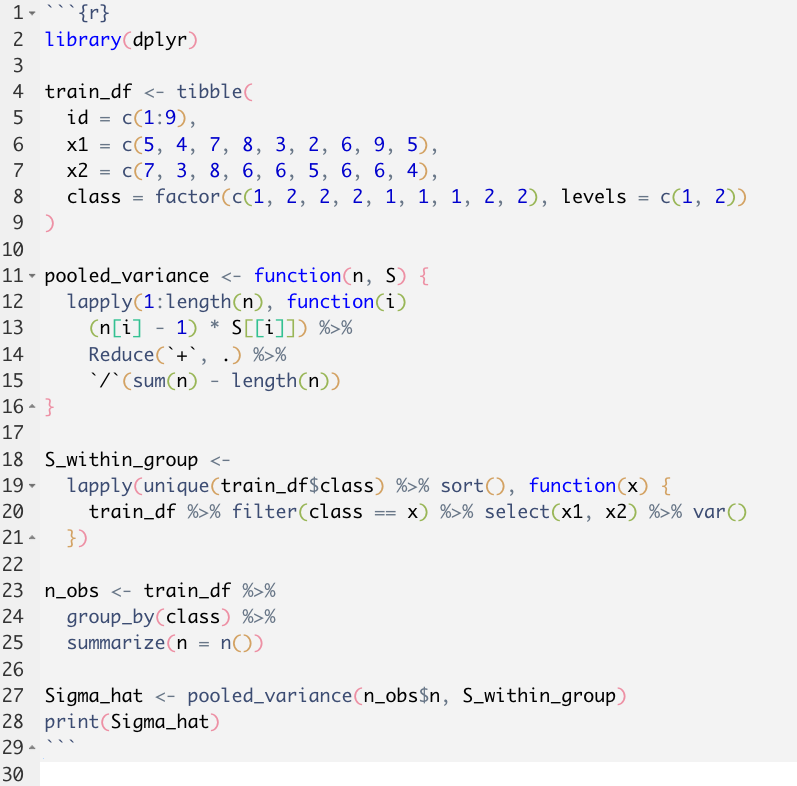
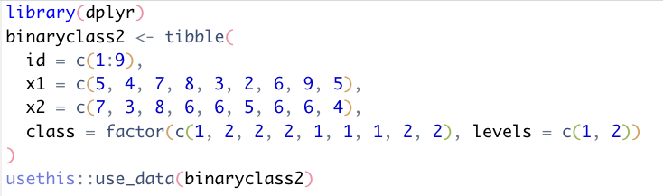
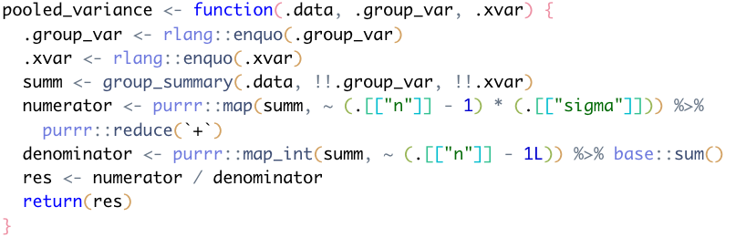
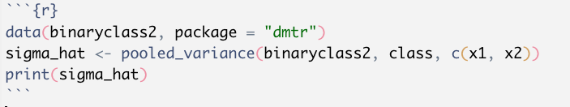
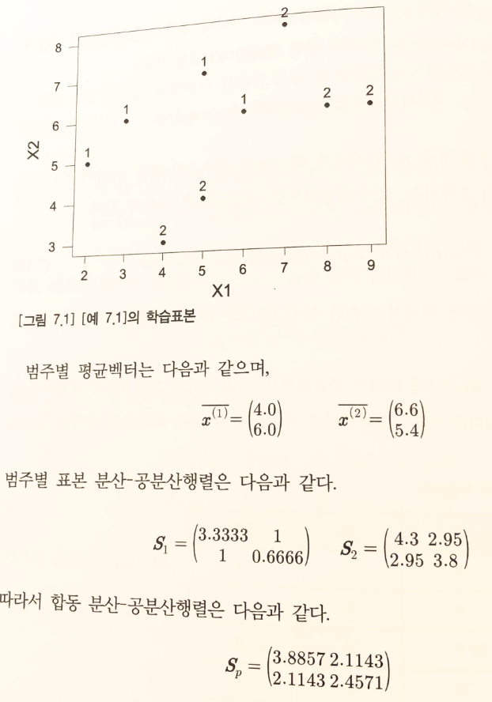
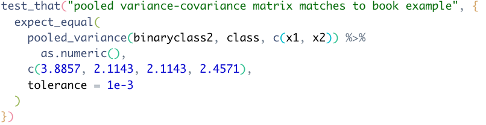
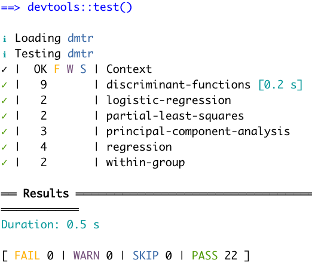

```{r setup, include=FALSE}
options(htmltools.dir.version = FALSE)
```

class: inverse, left, middle

1. 데이터 분석 문서화에서 패키지 개발로 전환

  - 배경
  
  - 작업 과정
  
2. 데이터 분석가에게 유용한 개발자 관점

  - 프로젝트 관리
  
  - 단위 테스트
  
  - 메타 프로그래밍
  
  - 리펙토링


---
class: inverse, center, middle

# 데이터 분석 문서화에서 패키지 개발로 전환

## 배경

---

# 데이터마이닝 기법과 응용

```{r book, echo = FALSE, fig.cap="데이터미아닝 기법과 응용 / 한나래출판사 / 전치혁 저", out.height='400px', fig.align='center'}
knitr::include_graphics("images/book-cover.jpg")
```


---

# `{bookdown}`을 이용한 R 예제 책 만들기

```{r online-book-webshot, include=FALSE, cache=TRUE}
webshot::webshot(
  url = "https://youngroklee-ml.github.io/data-mining-book/index.html",
  file = "images/onlinebook-main.jpg",
  zoom = 3
)
```


```{r online-book, echo = FALSE, fig.cap="데이터마이닝 with R / Published with bookdown / 전치혁, 이혜선, 이종석, 이영록 공저", out.height='400px', fig.align='center'}
knitr::include_graphics("images/onlinebook-main.jpg")
```


---

# 교재용 R 패키지 작성의 필요성

--

- 알고리즘의 단계별 결과를 교재 내용대로 보여주기 위해 함수를 세분화할 필요

--

- 기존 R 패키지가 교재에 설명된 알고리즘과 정확히 일치하지 않는 부분에 대한 혼동을 줄일 필요

--

- 사용된 기존 R 패키지의 버전업에 따른 교재의 R 스크립트 수정을 줄일 필요

---
class: inverse, center, middle

# 데이터 분석 문서화에서 패키지 개발로 전환

## 작업 과정


---

# 현실적인 작업범위 및 기대수준 정의

- 참고교재

- 실무용 아님

- 제한된 유연성

---

# 편리한 작업환경 선택

.pull-left[

- RStudio IDE

- `{devtools}`, `{usethis}`, `{testthat}`, etc.

- Git and GitHub

]

--

.pull-right[

```{r r-packages-book, echo = FALSE, fig.cap="R Packages / O'Reilly / Hadley Wickham", out.width='40%', fig.align='center'}
knitr::include_graphics("images/r-pkgs-cover.png")
```

]


---

# R 스크립트 분류 및 재구성

- R 스크립트를 목적별로 분류하여 각 목적에 맞는 폴더에 저장

.pull-left[

```{r r-script-before, echo = FALSE, fig.cap="작업 이전 R Markdown 파일", out.width='80%', fig.align='center'}

```

]

--

.pull-right[

```{r r-script-after-data-raw, echo = FALSE, out.width='70%', fig.cap="데이터 생성: data-raw/ 폴더", fig.align='center'}

```

```{r r-script-after-function-r, echo = FALSE, out.width='70%', fig.cap="함수 정의: R/ 폴더", fig.align='center'}

```

```{r r-script-after-vignettes, echo = FALSE, out.width='70%', fig.cap="데이터 분석 문서: vignettes/ 폴더", fig.align='center'}

```

]


---

# 함수 도움말 문서 작성

- `{roxygen2}`를 이용한 함수 도움말 작성

```{r r-function-manual, echo = FALSE, fig.cap="함수 도움말 작성 및 컴파일된 도움말 파일", out.width='49%', fig.align='center', fig.show='hold'}
knitr::include_graphics(c(
  "images/r-function-manual.png",
  "images/r-function-manual-rendered.png"
))
```


---

# 단위 테스트 작성

- `{testthat}`을 이용한 예제 결과 재현성 테스트

.pull-left[

```{r unit-test-book-example, echo = FALSE, fig.cap="단위 테스트 사용할 예제", out.width='50%', fig.align='center'}

```

]

--

.pull-right[

```{r unit-test-script, echo = FALSE, out.width='70%', fig.cap="단위 테스트 작성: tests/ 폴더", fig.align='center'}

```

```{r unit-test-result, echo = FALSE, out.width='50%', fig.cap="단위 테스트 결과", fig.align='center'}

```

]

---

# 패키지 사이트 생성 

- `{pkgdown}`을 이용한 패키지 웹사이트 생성

```{r pkgdown-site, echo = FALSE, out.width='50%', fig.cap="패키지 웹사이트", fig.align='center'}
knitr::include_graphics("images/pkgdown-site.gif")
```
 


---
class: inverse, center, middle

# 데이터 분석가에게 유용한 개발자 관점

---

# 프로젝트 관리

- 일관된 프로젝트 폴더 구조

- Package dependency

- Git


---

# 단위 테스트

- 


---

# 리팩토링 (Refactoring)

- 함수화

- 메타 프로그래밍

- 

---


