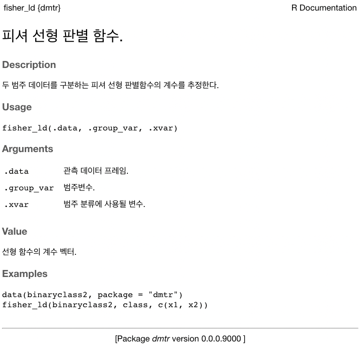

```{r setup, include = FALSE}
library(gt)
library(ggplot2)
library(dplyr)
library(dmtr)

options(
  htmltools.dir.version = FALSE, 
  htmltools.preserve.raw = FALSE,
  tibble.width = 60, tibble.print_min = 6,
  crayon.enabled = TRUE
)

knitr::opts_chunk$set(
  echo = FALSE,
  message = FALSE,
  warning = FALSE,
  comment = "",
  digits = 3,
  tidy = FALSE,
  prompt = FALSE,
  fig.align = 'center',
  # fig.width = 7.252,
  # fig.height = 4,
  dpi = 600
)

# uncomment the following lines if you want to use the NHS-R theme colours by default
# scale_fill_continuous <- partial(scale_fill_nhs, discrete = FALSE)
# scale_fill_discrete <- partial(scale_fill_nhs, discrete = TRUE)
# scale_colour_continuous <- partial(scale_colour_nhs, discrete = FALSE)
# scale_colour_discrete <- partial(scale_colour_nhs, discrete = TRUE)
```

class: title-slide, left, bottom

# `r rmarkdown::metadata$title`
----
### `r rmarkdown::metadata$author`
### `r rmarkdown::metadata$date`

```{r, comment="", results="asis"}
old.hooks <- fansi::set_knit_hooks(knitr::knit_hooks)
```


---
class: inverse, left, middle

# 발표 개요

----

1. 데이터 분석 문서화에서 패키지 개발로 전환

  - 배경
  
  - 동기
  
  - 작업 과정
  
2. 데이터 분석가에게 유용한 개발자 관점

  - 프로젝트 관리
  
  - 변화 관리
  
  - 코드의 재사용성 향상

3. 맺음말
  

---
class: inverse, center, middle

# 데이터 분석 문서화에서 패키지 개발로 전환

---
class: inverse, center, middle

# 배경

---
class: middle
layout: true

.pull-left[

```{r book, echo = FALSE, fig.cap="데이터마이닝 기법과 응용 / 한나래출판사 / 전치혁 저", out.height='400px', fig.align='center'}
knitr::include_graphics("images/book-cover.jpg")
```

]

---

---

.pull-right[

```{r lda-example-plot, echo=FALSE, out.width='80%', fig.align='center', fig.cap="예제: 선형 분류분석"}
data(binaryclass2, package = "dmtr")

binaryclass2 %>% 
  ggplot(aes(x = x1, y = x2, color = class)) +
  geom_abline(slope = 0.9781, intercept = 0.3414, 
              color = "grey20", linetype = "dashed") +
  geom_point(size = 5) +
  geom_text(aes(label = class), vjust = -1, size = 5) +
  scale_x_continuous(
    breaks = seq(1, 10, by = 1),
    minor_breaks = NULL,
    expand = expansion(mult = 0.05)
  ) +
  scale_y_continuous(
    breaks = seq(1, 10, by = 1),
    minor_breaks = NULL,
    expand = expansion(mult = 0.05)
  ) +
  scale_color_manual(
    values = c(`1` = "steelblue", `2` = "firebrick")
  ) +
  theme_light() +
  theme(
    legend.position = "none",
    text = element_text(size = 20),
    aspect.ratio = 1
  )
```

]

---

.pull-right[

- 데이터 마이닝 알고리즘을 잘 이해할 수 있게 깔끔하게 구성된 교재
{{content}}

]

--

- 단순히 기존 패키지를 사용하는 것보다 깊이 있는 내용을 제공
{{content}}

--

- 간단하면서 결과를 눈으로 확인할 수 있는 예제들
{{content}}

--

- **예제 결과 도출을 위한 프로그램 구현은 제공되지 않음**
{{content}}


---
class: middle
layout: false


.pull-left[

```{r rlogo, out.width="70%"}
knitr::include_graphics(c("images/Rlogo.png"))
```

]

.pull-right[

```{r bookdownlogo, out.width="70%"}
knitr::include_graphics(c("images/bookdown-logo.png"))
```

]


---
class: middle

.pull-left[

```{r online-book-webshot, include=FALSE, cache=TRUE}
webshot::webshot(
  url = "https://youngroklee-ml.github.io/data-mining-book/index.html",
  file = "images/onlinebook-main.jpg",
  zoom = 3
)
```

```{r online-book, echo = FALSE, fig.cap="데이터마이닝 with R / 전치혁, 이혜선, 이종석, 이영록 / http://youngroklee-ml.github.io/data-mining-book/", out.height='400px', fig.align='center'}
knitr::include_graphics("images/onlinebook-main.jpg")
```

]

.pull-right[
  {{content}}
]

--

- 온라인 버전 보조 교재로 활용
{{content}}

--

- 예제를 R로 구현한 내용을 추가
{{content}}

--

- 기존 R 패키지가 제공하지 않는 세부 결과 도출과정을 구현
{{content}}

--

- 기존 R 패키지가 교재 설명과는 다른 알고리즘 사용한 경우에 대한 추가 설명
{{content}}

---
class: middle

```{r bookdown-folder, out.width="50%"}
knitr::include_graphics("images/bookdown-folder.png")
```


---
class: inverse, center, middle
layout: false

# 동기


---
class: middle, center

# 사용자 함수의 난립

---
# 사용자 함수의 난립

.pull-left[

```{r rmd-single-image, out.width="80%"}
knitr::include_graphics("images/rmd_image.png")
```

]

.pull-right[

{{content}}

]

--

데이터 생성
{{content}}

--

**함수 1**
{{content}}

--

**함수 2**
{{content}}

--

분석
{{content}}

--

**함수 3**
{{content}}

--

분석
{{content}}

--

데이터 생성
{{content}}

--

**함수 4**
{{content}}

--

**함수 5**
{{content}}

--

데이터 분석
{{content}}

--

**...**
{{content}}


---

# 사용자 함수의 난립

.pull-left[

```{r multiple-rmd-image, out.width="80%"}
knitr::include_graphics("images/bookdown-folder.png")
```

]

--

.pull-right[

```{r disorganized-spoons, out.width="90%"}

```

]


---
class: middle, center

# 지금은 맞고, 나중엔 틀릴수도?

---
class: middle

.pull-left[

```{r namespace-1, echo=TRUE, error=TRUE}
library(dplyr)

data(binaryclass2, package = "dmtr")

binaryclass2 %>% 
  select(x1, x2) #<<
```

]

--

.pull-right[
```{r}
detach(package:dplyr)
```

```{r namespace-2, echo=TRUE, error=TRUE}
library(dplyr)

data(binaryclass2, package = "dmtr")

library(MASS)
fit <- lda(class ~ x1 + x2, binaryclass2)

binaryclass2 %>% 
  select(x1, x2) #<<
```

```{r}
detach(package:MASS)
```

]

---
class: middle

.pull-left[

**`{tidyr}` 0.x**

```r
df <- tibble(
 a = list(c("a", "b"), "c"),
 b = list(1:2, 3),
 c = c(11, 22)
)
* df %>% tidyr::unnest(a, b)
```

```{r unnest-old}
df <- tibble(
 a = list(c("a", "b"), "c"),
 b = list(1:2, 3),
 c = c(11, 22)
)
df %>% tidyr::unnest_legacy(a, b)
```

]

--

.pull-right[

**`{tidyr}` 1.0.0**

```{r unnest-new, echo=TRUE}
df <- tibble(
 a = list(c("a", "b"), "c"),
 b = list(1:2, 3),
 c = c(11, 22)
)
df %>% tidyr::unnest(c(a, b)) #<<
```


]

---
class: middle

- 오류 발생 시 수정에 많은 시간 소요 

- 코드 실행 오류는 없으나 결과가 틀린 경우는 오류 발견 자체가 어려움


---
class: inverse, center, middle
layout: false

# 작업 과정

---
class: center, middle

.pull-left[

```{r r-packages-book, echo = FALSE, fig.cap="R Packages / O'Reilly / Hadley Wickham", out.width='80%', fig.align='center'}
knitr::include_graphics("images/r-pkgs-cover.png")
```

]

.pull-right[

```{r r-devtools-logo, echo = FALSE, out.width='80%', fig.align='center'}
knitr::include_graphics("images/devtools-logo.svg")
```

]


---
class: center, middle

# R Markdown 문서 해체 및 재구성

---

# R Markdown 문서 해체 및 재구성

.pull-left[

````
```{r}`r ''`
binaryclass2 <- tribble(
  ~id, ~x1, ~x2, ~class,
  1, 5, 7, 1,
  2, 4, 3, 2,
  3, 7, 8, 2,
  4, 8, 6, 2,
  5, 3, 6, 1,
  6, 2, 5, 1,
  7, 6, 6, 1,
  8, 9, 6, 2,
  9, 5, 4, 2
)

group_mean <- function(...) {...}
pooled_variance <- function(...) {...}
fisher_ld <- function(...) {...}

w_hat <- fisher_ld(
  binaryclass2, class, x1:x2)
print(w_hat)
```
````

]

---

# R Markdown 문서 해체 및 재구성

.pull-left[

````
```{r}`r ''`
*binaryclass2 <- tribble(
*  ~id, ~x1, ~x2, ~class,
*  1, 5, 7, 1,
*  2, 4, 3, 2,
*  3, 7, 8, 2,
*  4, 8, 6, 2,
*  5, 3, 6, 1,
*  6, 2, 5, 1,
*  7, 6, 6, 1,
*  8, 9, 6, 2,
*  9, 5, 4, 2
*)

group_mean <- function(...) {...}
pooled_variance <- function(...) {...}
fisher_ld <- function(...) {...}

w_hat <- fisher_ld(
  binaryclass2, class, x1:x2)
print(w_hat)
```
````

]


.pull-right[

```{r data-raw-example, out.width='30%', fig.align='center'}
knitr::include_graphics(c(
  "images/data-raw-folder-icon.png", 
  "images/data-raw-binaryclass.png"))
```


]


---

# R Markdown 문서 해체 및 재구성

.pull-left[

````
```{r}`r ''`
binaryclass2 <- tribble(
  ~id, ~x1, ~x2, ~class,
  1, 5, 7, 1,
  2, 4, 3, 2,
  3, 7, 8, 2,
  4, 8, 6, 2,
  5, 3, 6, 1,
  6, 2, 5, 1,
  7, 6, 6, 1,
  8, 9, 6, 2,
  9, 5, 4, 2
)

*group_mean <- function(...) {...}
*pooled_variance <- function(...) {...}
*fisher_ld <- function(...) {...}

w_hat <- fisher_ld(
  binaryclass2, class, x1:x2)
print(w_hat)
```
````

]


.pull-right[

```{r r-example, out.width='30%', fig.align='center'}
knitr::include_graphics(c(
  "images/r-folder-icon.png", 
  "images/r-within-group.png",
  "images/r-discriminant-functions.png"))
```

]


---

# R Markdown 문서 해체 및 재구성

.pull-left[

````
```{r}`r ''`
binaryclass2 <- tribble(
  ~id, ~x1, ~x2, ~class,
  1, 5, 7, 1,
  2, 4, 3, 2,
  3, 7, 8, 2,
  4, 8, 6, 2,
  5, 3, 6, 1,
  6, 2, 5, 1,
  7, 6, 6, 1,
  8, 9, 6, 2,
  9, 5, 4, 2
)

group_mean <- function(...) {...}
pooled_variance <- function(...) {...}
fisher_ld <- function(...) {...}

*w_hat <- fisher_ld(
*  binaryclass2, class, x1:x2)
*print(w_hat)
```
````

]


.pull-right[

```{r vignettes-example, out.width='30%', fig.align='center'}
knitr::include_graphics(c(
  "images/vignettes-folder-icon.png", 
  "images/vignettes-discriminant-analysis.png"))
```

]

---

# R Markdown 문서 해체 및 재구성

.pull-left[

````
```{r}`r ''`
library(dmtr)

w_hat <- fisher_ld(
  binaryclass2, class, x1:x2)
print(w_hat)
```
````

]


.pull-right[

```{r vignettes-example-2, out.width='30%', fig.align='center'}
knitr::include_graphics(c(
  "images/vignettes-folder-icon.png", 
  "images/vignettes-discriminant-analysis.png"))
```

]


---
class: middle, center

# 함수 도움말 문서 작성

---

# 함수 도움말 문서 작성

```{r roxygen-logo, out.width='30%'}
knitr::include_graphics(
  "images/roxygen2-logo.png"
)
```

---
layout: true

# 함수 도움말 문서 작성

.pull-left[

```r
#' 피셔 선형 판별 함수.
#'
#' 두 범주 데이터를 구분하는 피셔 선형 판별함수의 
#' 계수를 추정한다.
#'
#' @param .data 관측 데이터 프레임.
#' @param .group_var 범주변수.
#' @param .xvar 범주 분류에 사용될 변수.
#' @return 선형 함수의 계수 벡터.
#'
#' @examples
#' data(binaryclass2, package = "dmtr")
#' fisher_ld(binaryclass2, class, c(x1, x2))
#'
#' @keywords discriminant-functions
#' @export
fisher_ld <- 
  function(.data, .group_var, .xvar) {...}
```

]

---

---

.pull-right[

```{r man-example, out.width='30%', fig.align='center'}
knitr::include_graphics(c(
  "images/man-folder-icon.png", 
  "images/man-fisher_ld.png"))
```

]

---

.pull-right[

```{r r-function-manual, echo = FALSE, fig.cap="함수 도움말 작성 및 컴파일된 도움말 파일 (.Rd)", out.width='90%', fig.align='center'}

```

]

---
class: middle, center
layout: false

# 코드 테스트

---

# 코드 테스트

```{r testthat-logo, out.width='30%'}
knitr::include_graphics(
  "images/testthat-logo.png"
)
```


---
layout: true

# 코드 테스트

예제 결과 재현성 테스트

```{r lda-book-example-2, echo = FALSE, out.width='50%', fig.align='center'}

```

---

---

```{r tests-example, out.width='10%', fig.align='center'}
knitr::include_graphics(c(
  "images/tests-folder-icon.png", 
  "images/tests-discriminant-functions.png"))
```

---

```{r lda-test, echo = TRUE}
library(testthat); library(dmtr);
test_that("Fisher discriminant function matches", {
  local_edition(3)
  expect_equal(
    fisher_ld(binaryclass2, class, x1:x2), #<<
    c(x1 = -1.5080, x2 = 1.5418), #<<
    tolerance = 1e-3,
    ignore_attr = TRUE
  )
})
```


---
class: middle, center
layout: false

# 패키지 웹사이트 생성

---

# 패키지 웹사이트 생성 

```{r pkgdown-logo, out.width='30%'}
knitr::include_graphics(
  "images/pkgdown-logo.png"
)
```


---

# 패키지 웹사이트 생성 

```{r pkgdown-site, echo = FALSE, out.width='70%', fig.cap="https://youngroklee-ml.github.io/dmtr/", fig.align='center'}
knitr::include_graphics("images/pkgdown-site.gif")
```
 


---
class: inverse, center, middle

# 데이터 분석가에게 유용한 개발자 관점

---

# 프로젝트 관리

- 일관된 프로젝트 폴더 구조

  + **data-raw/**: 데이터 생성/쿼리 R 스크립트 (.R)
  
  + **data/**: 생성된 데이터 파일 (.rda)
  
  + **R/**: 재사용을 위해 모듈화된 데이터 분석 함수 (.R)
  
  + **vignettes/**: 데이터 분석 문서 소스 (.Rmd)

  + **doc/**: 배포용 데이터 분석 문서 (.html)
  
  + **tests/**: 단위 테스트 (.R)


---

# 코드 테스트

.pull-left[
- 리팩토링(refactoring) 생산성 증가

- R 버전 및 패키지 업데이트에 따른 이상 유무 확인

- One is better than nothing
]

.pull-right[

```{r refactoring-book, echo = FALSE, fig.cap="Refactoring: improving the design of existing code / Addison-Wesley Professional / Martin Fowler", out.width='40%', fig.align='center'}
knitr::include_graphics("images/refact2.jpeg")
```

]


---
layout: true

# 코드 모호성 제거

---
- 네임스페이스 명시화 / `package::function()`

  + 패키지 로드 순서에 따라 결과가 달라지거나 오류 발생하는 문제 

---
- 네임스페이스 명시화 / `package::function()`

  + 어떤 패키지의 함수를 사용할 것인지 명시화

--

```{r namespace-3, echo=TRUE, error=TRUE}
dplyr::tibble(x = 1:2, y = 2:3) %>% 
  dplyr::select(x)
```


---
- 네임스페이스 명시화 / `package::function()`

  + 코드를 이해하기 쉽도록 도움

--

.pull-left[
```{r, echo=TRUE, message=FALSE}
library(dmtr)
library(corrr)
library(dplyr)
binaryclass2 %>% 
  select(x1, x2) %>% 
  correlate()
```
]

--

.pull-right[
```{r, echo=TRUE, message=FALSE}
library(dmtr)
library(dplyr)
binaryclass2 %>% 
  select(x1, x2) %>% 
  corrr::correlate()
```

]  

---
layout: false

# 코드의 재사용성 향상

- 메타 프로그래밍

  + 하드코딩 지양
  
  + **tidy eval** 프레임워크 활용

```r
fisher_ld <- function(.data, .group_var, .xvar) {
* .group_var <- rlang::enquo(.group_var)
* .xvar <- rlang::enquo(.xvar)
* mu_hat <- group_mean(.data, !!.group_var, !!.xvar)

  if (length(mu_hat) != 2L) {
    stop("number of levels of .group_var must be 2.")
  }

* sigma_hat <- pooled_variance(.data, !!.group_var, !!.xvar)

  res <- solve(sigma_hat) %*% purrr::reduce(mu_hat, `-`) %>% drop()
  attr(res, "group") <- attr(mu_hat, "group")
  return(res)
}

* fisher_ld(binaryclass2, class, c(x1, x2))
```


---
class: inverse, center, middle

# 맺음말

---

# 데이터 분석가에게 패키지 개발이란?

- 분석 과정 및 결과의 배포

  + 데이터, 분석 코드, 리포트 등
  
  + 재현가능성 검증
  
- 생산성 향상을 위한 배움의 과정

  + 프로젝트 관리
  
  + 코드 테스트
  
  + 코딩 스타일

- 경험의 축적이 중요

  + 쉬운 목표 설정

  + 기존에 수행한 가장 간단한 분석 프로젝트로 시작
  
  + 하나의 함수부터 시작


---

# 현실적인 작업범위 및 기대수준 정의

- 참고교재

- 실무용 아님

- 제한된 유연성

---

# 편리한 작업환경 선택

.pull-left[

- RStudio IDE

- `{devtools}`, `{usethis}`, `{testthat}`, etc.

- Git and GitHub

]


