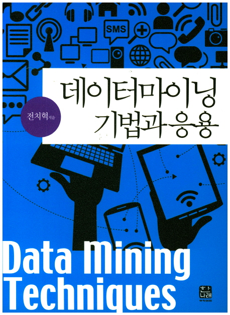
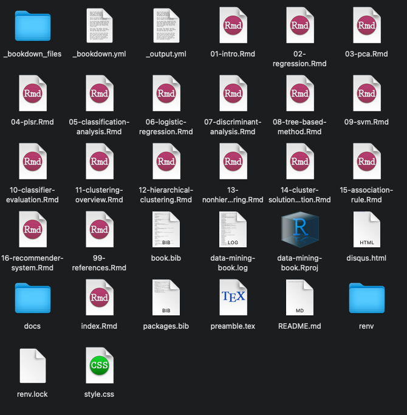

```{r setup, include = FALSE}
library(gt)
library(ggplot2)
library(dplyr)
library(dmtr)

options(
  htmltools.dir.version = FALSE, 
  htmltools.preserve.raw = FALSE,
  tibble.width = 60, tibble.print_min = 6,
  crayon.enabled = TRUE
)

knitr::opts_chunk$set(
  echo = FALSE,
  message = FALSE,
  warning = FALSE,
  comment = "",
  digits = 3,
  tidy = FALSE,
  prompt = FALSE,
  fig.align = 'center',
  # fig.width = 7.252,
  # fig.height = 4,
  dpi = 600
)

# uncomment the following lines if you want to use the NHS-R theme colours by default
# scale_fill_continuous <- partial(scale_fill_nhs, discrete = FALSE)
# scale_fill_discrete <- partial(scale_fill_nhs, discrete = TRUE)
# scale_colour_continuous <- partial(scale_colour_nhs, discrete = FALSE)
# scale_colour_discrete <- partial(scale_colour_nhs, discrete = TRUE)
```

class: title-slide, left, bottom

# `r rmarkdown::metadata$title`
----
### `r rmarkdown::metadata$author`
### `r rmarkdown::metadata$date`

```{r, comment="", results="asis"}
old.hooks <- fansi::set_knit_hooks(knitr::knit_hooks)
```


---
class: inverse, left, middle

# 발표 개요

----

  - 패키지 개발 배경
  
  - 주요 작업 과정

  - 데이터 분석가가 배우면 유용한 개발자 관점

  - 맺음말


---
class: inverse, center, middle

# 패키지 개발 배경

---
class: center, middle

# 데이터마이닝 교재 참고자료 제작

---
# 데이터마이닝 교재 참고자료 제작

.pull-left[

```{r book, echo = FALSE, fig.cap="데이터마이닝 기법과 응용 / 한나래출판사 / 전치혁 저", out.height='400px', fig.align='center'}

```

]

.pull-right[

- 데이터 마이닝 이론과 알고리즘을 잘 이해할 수 있게 깔끔하게 구성된 교재

- 간단하면서 결과를 눈으로 확인할 수 있는 예제들

- **예제 결과 도출을 위한 프로그램 구현은 제공되지 않음**

]


---
# 데이터마이닝 교재 참고자료 제작

.pull-left[

```{r online-book-webshot, include=FALSE, cache=TRUE}
webshot::webshot(
  url = "https://youngroklee-ml.github.io/data-mining-book/index.html",
  file = "images/onlinebook-main.jpg",
  zoom = 3
)
```

```{r online-book, echo = FALSE, fig.cap="데이터마이닝 with R / 전치혁, 이혜선, 이종석, 이영록 / http://youngroklee-ml.github.io/data-mining-book/", out.height='400px', fig.align='center'}
knitr::include_graphics("images/onlinebook-main.jpg")
```

]

.pull-right[

```{r rlogo-bookdown, out.width="30%"}
knitr::include_graphics(c("images/Rlogo.png", "images/bookdown-logo.png"))
```

- 온라인 버전 보조 교재로 활용

- 예제를 R로 구현한 내용을 추가

- 단순히 기존 R 패키지를 사용하는 것보다 깊이 있는 내용을 제공

]

---

# 데이터마이닝 교재 참고자료 제작


```{r bookdown-folder, out.width="50%"}

```


---
class: middle, center

# 정돈되지 않은 코드

---
# 정돈되지 않은 코드

.pull-left[

```{r rmd-single-image, out.width="80%"}
knitr::include_graphics("images/rmd_image.png")
```

]

.pull-right[

`df1 <- tibble()` \# 데이터 생성

`f1 <- function() {}` \# **함수 정의**

`f2 <- function() {}` \# **함수 정의**

`df1 %>% f1() %>% f2()` \# 분석

`f3 <- function() {}` \# **함수 정의**

`df1 %>% f1() %>% f3()` \# 분석

`df2 <- tibble()` \# 데이터 생성

`f4 <- function() {}` \# **함수 정의**

`f5 <- function() {}` \# **함수 정의**

`df2 %>% f1() %>% f4() %>% f5()` \# 분석

**...**

]

---

# 정돈되지 않은 코드

.pull-left[

```{r multiple-rmd-image, out.width="80%"}

```

]

--

.pull-right[

```{r messy-photo, out.width="90%"}
knitr::include_graphics("images/xavi-cabrera-kn-UmDZQDjM-unsplash.jpg")
```

]


---
class: middle, center

# 지금은 맞지만, 나중엔 틀릴수도?

---
# 지금은 맞지만, 나중엔 틀릴수도?

.pull-left[

```{r namespace-1, echo=TRUE, error=TRUE}
library(dplyr)

data(binaryclass2, package = "dmtr")

binaryclass2 %>% 
  select(x1, x2) #<<
```

]

.pull-right[
```{r}
detach(package:dplyr)
```

```{r namespace-2, echo=TRUE, error=TRUE}
library(dplyr)

data(binaryclass2, package = "dmtr")

library(MASS) #<<
fit <- lda(class ~ x1 + x2, binaryclass2) #<<

binaryclass2 %>% 
  select(x1, x2) #<<
```

```{r}
detach(package:MASS)
```

]

---
# 지금은 맞지만, 나중엔 틀릴수도?

.pull-left[

**`{tidyr}` 0.x**

```r
df <- tibble(
 a = list(c("a", "b"), "c"),
 b = list(1:2, 3),
 c = c(11, 22)
)
*df %>% tidyr::unnest(a, b)
```

```{r unnest-old}
df <- tibble(
 a = list(c("a", "b"), "c"),
 b = list(1:2, 3),
 c = c(11, 22)
)
df %>% tidyr::unnest_legacy(a, b)
```

]

.pull-right[

**`{tidyr}` 1.0.0**

```{r unnest-new, echo=TRUE}
df <- tibble(
 a = list(c("a", "b"), "c"),
 b = list(1:2, 3),
 c = c(11, 22)
)
df %>% tidyr::unnest(c(a, b)) #<<
```


]

---
class: center, middle

# 해결방안: 패키지 개발


---
class: inverse, center, middle
layout: false

# 주요 작업 과정

---
class: center, middle

.pull-left[

```{r r-packages-book, echo = FALSE, fig.cap="R Packages / O'Reilly / Hadley Wickham", out.width='80%', fig.align='center'}
knitr::include_graphics("images/r-pkgs-cover.png")
```

]

.pull-right[

```{r r-devtools-logo, echo = FALSE, out.width='80%', fig.align='center'}
knitr::include_graphics("images/devtools-logo.svg")
```

]


---
class: center, middle

# R Markdown 문서 해체 및 재구성

---

# R Markdown 문서 해체 및 재구성

.pull-left[

````
```{r}`r ''`
binaryclass2 <- tribble(
  ~id, ~x1, ~x2, ~class,
  1, 5, 7, 1,
  2, 4, 3, 2,
  3, 7, 8, 2,
  4, 8, 6, 2,
  5, 3, 6, 1,
  6, 2, 5, 1,
  7, 6, 6, 1,
  8, 9, 6, 2,
  9, 5, 4, 2
)

group_mean <- function(...) {...}
pooled_variance <- function(...) {...}
fisher_ld <- function(...) {...}

w_hat <- fisher_ld(
  binaryclass2, class, x1:x2)
print(w_hat)
```
````

]

---

# R Markdown 문서 해체 및 재구성

.pull-left[

````
```{r}`r ''`
*binaryclass2 <- tribble(
*  ~id, ~x1, ~x2, ~class,
*  1, 5, 7, 1,
*  2, 4, 3, 2,
*  3, 7, 8, 2,
*  4, 8, 6, 2,
*  5, 3, 6, 1,
*  6, 2, 5, 1,
*  7, 6, 6, 1,
*  8, 9, 6, 2,
*  9, 5, 4, 2
*)

group_mean <- function(...) {...}
pooled_variance <- function(...) {...}
fisher_ld <- function(...) {...}

w_hat <- fisher_ld(
  binaryclass2, class, x1:x2)
print(w_hat)
```
````

]


.pull-right[

```{r data-raw-example, out.width='20%', fig.align='center'}
knitr::include_graphics(c(
  "images/data-raw-folder-icon.png", 
  "images/data-raw-binaryclass.png"))
```


]


---

# R Markdown 문서 해체 및 재구성

.pull-left[

````
```{r}`r ''`
binaryclass2 <- tribble(
  ~id, ~x1, ~x2, ~class,
  1, 5, 7, 1,
  2, 4, 3, 2,
  3, 7, 8, 2,
  4, 8, 6, 2,
  5, 3, 6, 1,
  6, 2, 5, 1,
  7, 6, 6, 1,
  8, 9, 6, 2,
  9, 5, 4, 2
)

*group_mean <- function(...) {...}
*pooled_variance <- function(...) {...}
*fisher_ld <- function(...) {...}

w_hat <- fisher_ld(
  binaryclass2, class, x1:x2)
print(w_hat)
```
````

]


.pull-right[

```{r r-example, out.width='20%', fig.align='center'}
knitr::include_graphics(c(
  "images/r-folder-icon.png", 
  "images/r-within-group.png",
  "images/r-discriminant-functions.png"))
```

]


---

# R Markdown 문서 해체 및 재구성

.pull-left[

````
```{r}`r ''`
binaryclass2 <- tribble(
  ~id, ~x1, ~x2, ~class,
  1, 5, 7, 1,
  2, 4, 3, 2,
  3, 7, 8, 2,
  4, 8, 6, 2,
  5, 3, 6, 1,
  6, 2, 5, 1,
  7, 6, 6, 1,
  8, 9, 6, 2,
  9, 5, 4, 2
)

group_mean <- function(...) {...}
pooled_variance <- function(...) {...}
fisher_ld <- function(...) {...}

*w_hat <- fisher_ld(
*  binaryclass2, class, x1:x2)
*print(w_hat)
```
````

]


.pull-right[

```{r vignettes-example, out.width='20%', fig.align='center'}
knitr::include_graphics(c(
  "images/vignettes-folder-icon.png", 
  "images/vignettes-discriminant-analysis.png"))
```

]

---

# R Markdown 문서 해체 및 재구성

.pull-left[

````
```{r}`r ''`
*library(dmtr)

w_hat <- fisher_ld(
  binaryclass2, class, x1:x2)
print(w_hat)
```
````

]


.pull-right[

```{r vignettes-example-2, out.width='20%', fig.align='center'}
knitr::include_graphics(c(
  "images/vignettes-folder-icon.png", 
  "images/vignettes-discriminant-analysis.png"))
```

]


---
class: middle, center

# 함수 도움말 문서 작성

---

# 함수 도움말 문서 작성

```{r roxygen-logo, out.width='30%'}
knitr::include_graphics(
  "images/roxygen2-logo.png"
)
```

---
layout: true

# 함수 도움말 문서 작성

.pull-left[

```r
#' 피셔 선형 판별 함수.
#'
#' 두 범주 데이터를 구분하는 피셔 선형 판별함수의 
#' 계수를 추정한다.
#'
#' @param .data 관측 데이터 프레임.
#' @param .group_var 범주변수.
#' @param .xvar 범주 분류에 사용될 변수.
#' @return 선형 함수의 계수 벡터.
#'
#' @examples
#' data(binaryclass2, package = "dmtr")
#' fisher_ld(binaryclass2, class, c(x1, x2))
#'
#' @keywords discriminant-functions
#' @export
fisher_ld <- 
  function(.data, .group_var, .xvar) {...}
```

]

---

---

.pull-right[

```{r man-example, out.width='20%', fig.align='center'}
knitr::include_graphics(c(
  "images/man-folder-icon.png", 
  "images/man-fisher_ld.png"))
```

]

---

.pull-right[

```{r r-function-manual, echo = FALSE, fig.cap="컴파일된 도움말 파일 (.Rd)", out.width='90%', fig.align='center'}
knitr::include_graphics("images/r-function-manual-fisher_ld.png")
```

]

---
class: middle, center
layout: false

# 코드 테스트 작성

---

# 코드 테스트 작성

```{r testthat-logo, out.width='30%'}
knitr::include_graphics(
  "images/testthat-logo.png"
)
```


---
layout: true

# 코드 테스트 작성

예제 결과 재현성 테스트

```{r lda-book-example-2, echo = FALSE, out.width='50%', fig.align='center'}
knitr::include_graphics("images/lda-book-example-function.png")
```

---

---

```{r lda-test, echo = TRUE}
library(testthat); library(dmtr);
test_that("Fisher discriminant function matches", {
  local_edition(3)
  expect_equal( #<<
    fisher_ld(binaryclass2, class, x1:x2), #<<
    c(x1 = -1.5080, x2 = 1.5418), #<<
    tolerance = 1e-3,
    ignore_attr = TRUE
  )
})
```

---

```{r tests-example, out.width='8%', fig.align='center'}
knitr::include_graphics(c(
  "images/tests-folder-icon.png", 
  "images/tests-discriminant-functions.png"))
```


---
class: middle, center
layout: false

# 패키지 웹사이트 생성

---

# 패키지 웹사이트 생성 

```{r pkgdown-logo, out.width='30%'}
knitr::include_graphics(
  "images/pkgdown-logo.png"
)
```


---

# 패키지 웹사이트 생성 

```{r pkgdown-site, echo = FALSE, out.width='70%', fig.cap="https://youngroklee-ml.github.io/dmtr/", fig.align='center'}
knitr::include_graphics("images/pkgdown-site.gif")
```
 


---
class: inverse, center, middle

# 데이터 분석가가 배우면 유용한 개발자 관점

---
class: center, middle

# 체계적인 프로젝트 폴더 구조


---

# 체계적인 프로젝트 폴더 구조

.pull-left[

- 일관된 프로젝트 폴더 구조

  + **data-raw/: 데이터 생성/쿼리 R 스크립트 (.R)**
  
]

.pull-right[

```{r data-raw-folder-files, out.width='70%'}

```

]

---

# 체계적인 프로젝트 폴더 구조

.pull-left[

- 일관된 프로젝트 폴더 구조

  + data-raw/: 데이터 생성/쿼리 R 스크립트 (.R)
  
  + **data/: 생성된 데이터 파일 (.rda)**
  
]

.pull-right[

```{r data-folder-files, out.width='70%'}

```

]

---

# 체계적인 프로젝트 폴더 구조

.pull-left[

- 일관된 프로젝트 폴더 구조

  + data-raw/: 데이터 생성/쿼리 R 스크립트 (.R)
  
  + data/: 생성된 데이터 파일 (.rda)
  
  + **R/: 재사용을 위해 모듈화된 데이터 분석 함수 (.R)**

]

.pull-right[

```{r r-folder-files, out.width='70%'}

```

]

---

# 체계적인 프로젝트 폴더 구조

.pull-left[

- 일관된 프로젝트 폴더 구조

  + data-raw/: 데이터 생성/쿼리 R 스크립트 (.R)
  
  + data/: 생성된 데이터 파일 (.rda)
  
  + R/: 재사용을 위해 모듈화된 데이터 분석 함수 (.R)
  
  + **vignettes/: 데이터 분석 문서 소스 (.Rmd)**

]

.pull-right[

```{r vignettes-folder-files, out.width='70%'}

```

]

---

# 체계적인 프로젝트 폴더 구조

.pull-left[

- 일관된 프로젝트 폴더 구조

  + data-raw/: 데이터 생성/쿼리 R 스크립트 (.R)
  
  + data/: 생성된 데이터 파일 (.rda)
  
  + R/: 재사용을 위해 모듈화된 데이터 분석 함수 (.R)
  
  + vignettes/: 데이터 분석 문서 소스 (.Rmd)

  + **tests/: 코드 테스트 (.R)**

]

.pull-right[

```{r tests-folder-files, out.width='70%'}

```

]


---

# 체계적인 프로젝트 폴더 구조

.pull-left[

- 일관된 프로젝트 폴더 구조

  + **data-raw/**: 데이터 생성/쿼리 R 스크립트 (.R)
  
  + **data/**: 생성된 데이터 파일 (.rda)
  
  + **R/**: 재사용을 위해 모듈화된 데이터 분석 함수 (.R)
  
  + **vignettes/**: 데이터 분석 문서 소스 (.Rmd)

  + **tests/**: 코드 테스트 (.R)

]

.pull-right[

```{r tidy-photo, out.width="90%"}

```

]


---
class: center, middle

# 리팩토링

---

# 리팩토링

```{r refactoring-book, echo = FALSE, fig.cap="Refactoring: improving the design of existing code / Addison-Wesley Professional / Martin Fowler", out.width='30%', fig.align='center'}
knitr::include_graphics("images/refact2.jpeg")
```

---

# 리팩토링

- 코드 테스트

```{r test-results, out.width='50%'}

```

---

# 리팩토링

- 네임 스페이스 명시화

.pull-left[
```{r, echo=TRUE, message=FALSE}
library(dmtr)
library(corrr) #<<
library(dplyr)
binaryclass2 %>% 
  select(x1, x2) %>% 
  correlate() #<<
```
]

.pull-right[
```{r, echo=TRUE, message=FALSE}
library(dmtr)
library(dplyr)
binaryclass2 %>% 
  select(x1, x2) %>% 
  corrr::correlate() #<<
```

]  


---

# 리팩토링

- 메타 프로그래밍

  + 하드코딩 지양

```{r rlang-logo, out.width='30%'}
knitr::include_graphics(
  "images/rlang-logo.png"
)
```


---
class: inverse, center, middle

# 맺음말

---
class: center, middle

# 데이터 분석가에게 패키지 개발이란?

---

# 데이터 분석가에게 패키지 개발이란?

- 분석 과정과 결과의 배포

  + 데이터, 분석 코드, 리포트 등
  
  + 재현가능성 검증

--

.pull-left[

```{r cook, fig.alt='https://unsplash.com/photos/gPpbFaEkl00', out.width='80%'}
knitr::include_graphics("images/nikolay-smeh-gPpbFaEkl00-unsplash.jpg")
```

]

--

.pull-right[

```{r recipe, fig.alt='https://www.10000recipe.com/recipe/6839413', out.width='100%', fig.cap='https://www.10000recipe.com/recipe/6839413'}

```

]

---

# 데이터 분석가에게 패키지 개발이란?

- 생산성 향상을 위한 배움의 과정

  + 프로젝트 관리
  
  + 리팩토링
  
--

.pull-left[

```{r messy-photo-2, fig.alt='https://unsplash.com/photos/kn-UmDZQDjM', out.width="90%"}
knitr::include_graphics("images/xavi-cabrera-kn-UmDZQDjM-unsplash.jpg")
```

]

--

.pull-right[

```{r tidy-photo-2, fig.alt='https://unsplash.com/photos/gNMVpAPe3PE', out.width="90%"}

```

]


---
class: center, middle

# 어떻게 시작할까?


---

# 어떻게 시작할까?

- 마음가짐: 위축되거나 포기하지 않기

  + 단발성 분석 업무보다 많은 시간과 노력이 소요
  
  + 경험의 축적이 중요

  + 자신에게 맞는 기대 수준과 페이스 찾기

--

- 기존에 수행한 간단한 분석 프로젝트로 시작

  + 하나의 데이터, 하나의 함수, 하나의 테스트부터 시작

--

- 분석 업무와 패키지 개발의 선순환

  + 습득한 개발 방법을 분석 업무에 적용

  + 분석 업무에서 패키지 아이디어 확장


---
class: center, middle, inverse

# 감사합니다

# **

#### 특히 고마운 분들: 
#### 전치혁 교수님
#### 이혜선 교수님
#### 이종석 교수님
